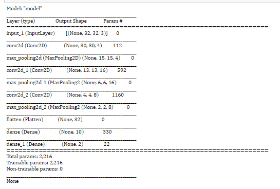
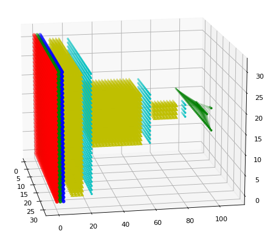

## Netplot
A ultra-lightweight 3D renderer of the Tensorflow/Keras neural network architectures.
This Library is working on Matplotlib visualization for now. In future the visualization can be moved to plotly 
for a more interactive visual of the neural network architecture. 

### Usage guide

```python
from netplot import ModelPlot
import tensorflow as tf
import numpy as np
```

```python
%matplotlib notebook
```

```python
X_input = tf.keras.layers.Input(shape=(32,32,3))
X = tf.keras.layers.Conv2D(4, 3, activation='relu')(X_input)
X = tf.keras.layers.MaxPool2D(2,2)(X)
X = tf.keras.layers.Conv2D(16, 3, activation='relu')(X)
X = tf.keras.layers.MaxPool2D(2,2)(X)
X = tf.keras.layers.Conv2D(8, 3, activation='relu')(X)
X = tf.keras.layers.MaxPool2D(2,2)(X)
X = tf.keras.layers.Flatten()(X)
X = tf.keras.layers.Dense(10, activation='relu')(X)
X = tf.keras.layers.Dense(2, activation='softmax')(X)

model = tf.keras.models.Model(inputs=X_input, outputs=X)
```
```python
modelplot = ModelPlot(model=model, grid=True, connection=True, linewidth=0.1)
modelplot.show()
```

